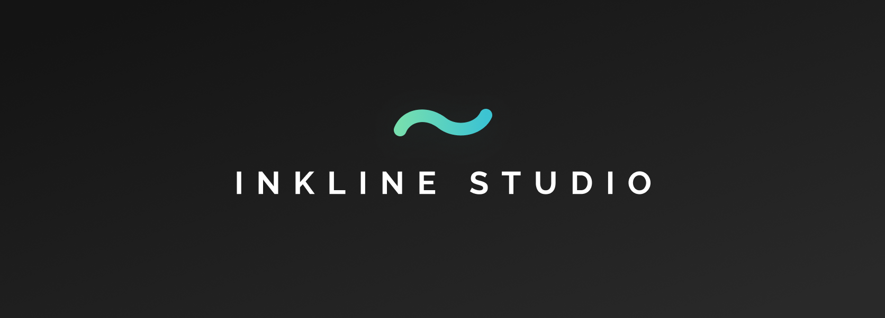
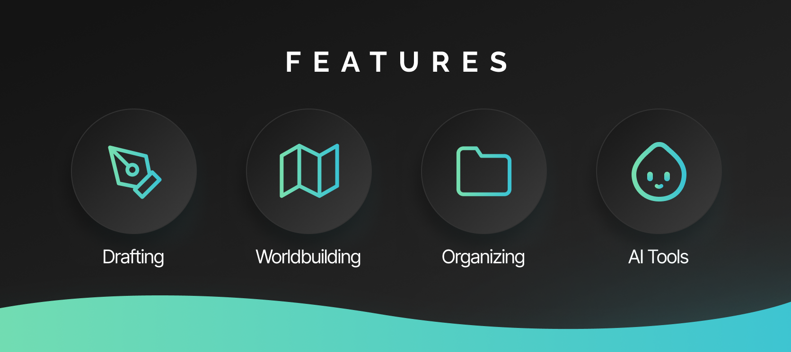
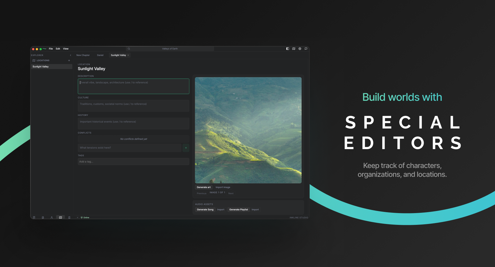
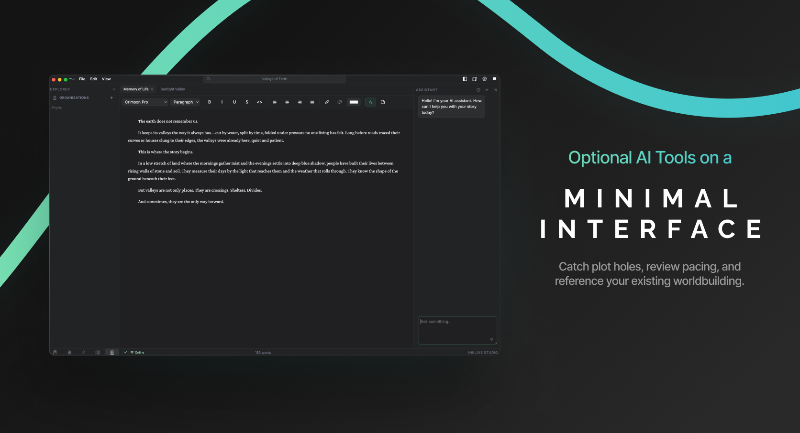
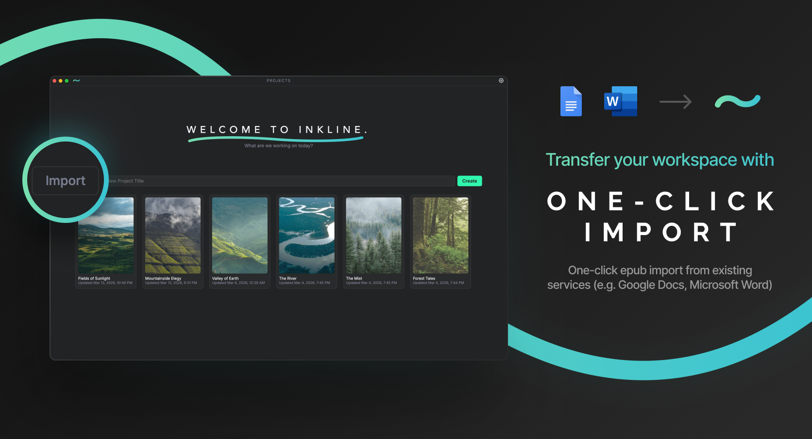
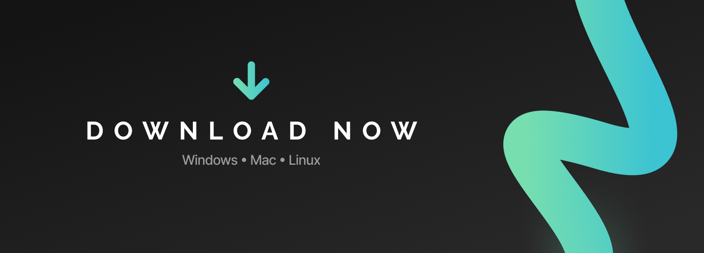

  
  
  
  

---

  <h3>Every story starts with a single stroke.</h3>

Welcome to **INKLINE STUDIO** — a dedicated document editor for creative writers. Unlike generic apps like Google Docs or Microsoft Word, we offer dedicated interfaces to keep track of characters, organizations, or locations within your story, and methods to connect them like never before. Think of us like Campfire mixed with Scrivener — and completely free and open-source, forever.

    <h3><i>"Built by writers, for writers."</i></h3>

https://github.com/user-attachments/assets/1a32900d-767d-4b53-afd5-9ca8c03a2fa8

---

- Sync across all your devices
- Keep track of characters, locations, and organizations with reference images, playlists, tracks, and custom metafields to fit any need
- Export manuscript to EPUB format directly
- One-click import from existing services (e.g. Google Docs, Microsoft Word)
- **Optional** AI editor for those who don't have access to a human one
- Generate reference images, songs, and compile playlists from scratch based on your character/location/organization's descriptions
- And much more to come!

---

---

### Windows
[Download](https://github.com/enxilium/inkline/releases/download/v0.1.1-alpha/inkline-0.1.1-alpha.Setup.exe)
### MacOS
[Download](https://github.com/enxilium/inkline/releases/download/v0.1.1-alpha/inkline-0.1.1-alpha-arm64.dmg)
### Linux (.deb)
[Download](https://github.com/enxilium/inkline/releases/download/v0.1.1-alpha/inkline_0.1.1.alpha_amd64.deb)

To build it yourself, you can find the binaries on the [**Releases**](https://github.com/enxilium/inkline/releases) page.

## 📄 License

This project is licensed under the **MIT License**.

---

## 👤 Authors

Created by [**@enxilium**](https://github.com/enxilium) and [**@sukdip**](https://github.com/sukdippa).

If you have any questions or concerns, feel free to open an issue or contact us at `enxil.` or `sukdip` on Discord.

---

<!-- CONTRIBUTING -->
## Contributing

Contributions are what make the open source community such an amazing place to learn, inspire, and create. Any contributions you make are welcome and **greatly appreciated**!

If you have a suggestion that would make this better, please fork the repo and create a pull request. You can also simply open an issue with the tag "enhancement".
Don't forget to give the project a star! Thanks again!

1. Fork the Project
2. Create your Feature Branch (`git checkout -b feature/AmazingFeature`)
3. Commit your Changes (`git commit -m 'Add some AmazingFeature'`)
4. Push to the Branch (`git push origin feature/AmazingFeature`)
5. Open a Pull Request

### Top contributors:

(<a href="#readme-top">back to top</a>)

